<div align="center">




<br/>

[](https://www.linkedin.com/in/paarth-asri/)
[](https://x.com/paarth_asri)
[](mailto:paarthasri96@gmail.com)
[](https://github.com/PaarthAsri)

</div>


## `[ whoami ]`

```bash
$ whoami
Systems Associate @ Infosys — SAP EAM integration & automation testing (Java, Selenium)
Independent security researcher — AppSec / VAPT / SOC operations
ISC2 certified · Studying for CompTIA Security+ (SY0-701)
Career track: AppSec → Pentest → OSCP
```


## `[ active_ops ]`

```diff
+ Independent bug bounty operation running on WSL2 Ubuntu 24.04
+ Toolchain: subfinder · httpx · nuclei · Burp Suite · fabric AI (Groq/llama-3.3-70b) · Gemini CLI agents
+ Custom fabric patterns: bb_triage, analyze_bb_findings, write_bb_report
+ Building unified methodology for web/API + smart contract auditing
```

### `>> confirmed findings`

| Target Type | Class | Status |
|---|---|---|
| Open-source integration connectors | Path Traversal / XXE / SSRF / Arbitrary File R-W | Disclosed · Bounty x2 |
| Vector database platform | Blind SSRF (DNS callback confirmed) | Disclosed |
| Vector database platform | Stored XSS (unsanitized input field) | Disclosed |
| SaaS analytics platform | Cloud subdomain takeover | Disclosed |
| Fintech platform | Exposed API key + error-tracking DSN | Disclosed |
| Trading platform | Potential subdomain takeover | Reported |
| Blockchain node (L1) | In progress | Auditing |


<div align="center">

</div>

## `[ arsenal ]`

**Offense / AppSec**


**Automation / Testing**


**Languages**


**Cloud / Infra**


<div align="center">

</div>

## `[ stats ]`

<div align="center">


</div>


## `[ contribution_grid ]`

<div align="center">

<!-- populated automatically after the workflow in the setup steps runs -->


</div>


<div align="center">


</div>
